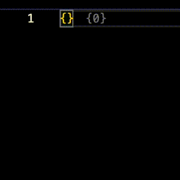

# JSON Key Count

A Visual Studio Code extension that adds inline decorations to JSON files, showing the number of direct children for each object `{#}` or array `[#]`.



## Features
- Inline annotations that show `{#}` or `[#]` next to each JSON key
- Updates as you edit
- Toggle decorations on/off globally or per-workspace

## Settings
You can control whether decorations are enabled using either the command palette or settings:

Via Command Palette:
- Toggle JSON Key Count (User)
- Toggle JSON Key Count (Workspace)

Or in your settings.json:
```json
"jsonKeyDecorations.enabled": true
```

## Performance
This extension includes optimizations to avoid slowing down large JSON files:
- Decorations are throttled during typing
- Files over 10MB or 15,000 lines are skipped


## Installation
Search for JSON Key Count in the VSCode Extensions Marketplace or go here: 

TODO - [Link to vscode marketplace]

## Contributing
Suggestions, issues, and pull requests are welcome! Open an issue or fork the project at:

TODO - [GitHub Repository Link Here]

## License
[MIT](./LICENSE)

## TODO

- [X] Add tests
- [X] Test a couple large files
- [X] Proofread the readme
- [X] Add a screenshot or GIF
- [ ] Update changelog with initial release info
- [ ] make sure semVer is set
- [ ] add categories to package.json
- [ ] Add a link to the GitHub repo
- [ ] Add a link to the VSCode Marketplace listing